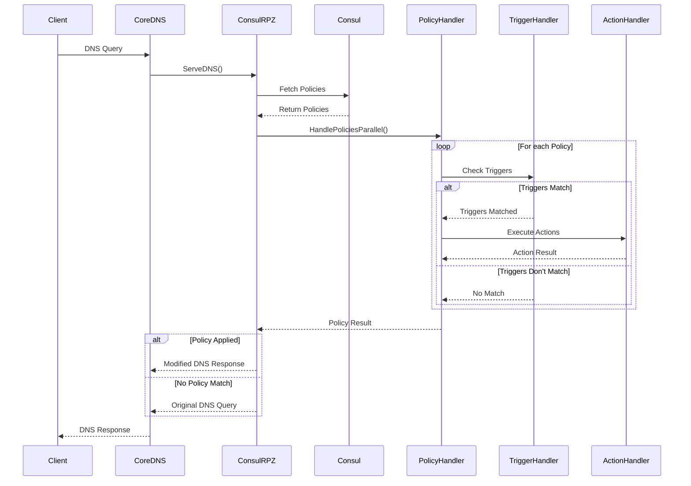

# CoreDNS ConsulRPZ Plugin

This plugin enables CoreDNS to use custom Response Policy Zones (RPZ) for DNS filtering and policy enforcement.

> [!IMPORTANT]
> This plugin is still actively being worked on. \
> Expect possible changes or reworks of how this plugin functions and how the config is structured.
>
> Additionally, this README isn't always up-to-date, so not everything mentioned here might work as described.

## Features

- Use Consul KV as a backend for RPZ policies
- Real-time policy updates via Consul KV
- Support for various RPZ triggers and actions
- Configurable policy priorities
- Metrics for monitoring (compatible with Prometheus)

## Architecture

The CoreDNS RPZ Plugin follows a modular architecture to process DNS queries and apply RPZ policies:



## Installation

To use this plugin, you need to compile it into CoreDNS. Add the following line to the `plugin.cfg` file in your CoreDNS source code:

```
consulrpz:github.com/mwantia/coredns-consulrpz-plugin
```

Then, rebuild CoreDNS with:

```sh
go get github.com/mwantia/coredns-consulrpz-plugin
go generate
go build
```

## Configuration

Add the plugin to your CoreDNS configuration file (Corefile):

```corefile
consulrpz <prefix> {        # eg. dns/policies
  address   = [<address>]   # eg. http://127.0.0.1:8500 
  token     = [<token>]     # Token for ACL access
  watch     = [<watch>]     # boolean if watch enabled or not
  execution = [<execution>] # parallel or sequence
}
```

### Configuration options:

- `prefix`:    Consul KV prefix for loading policies (Can be defined multiple times)
- `address`:   Consul HTTP address (defaults: `http://127.0.0.1:8500`)
- `token`:     Consul ACL token (optional)
- `watch`:     If set, plugin will watch for any changes and updates the policies with matching names (defaults: `true`)
- `execution`: Defines the execution mode, which can either be `sequence` or `parallel` (defaults: `parallel`)
  - `sequence`: Executes all policies in sequence, sorted by priority and returns after getting a result
  - `parallel`: Executes all policies in parallel and returns a result as soon as a satisfying match is found

## Policy Configuration

Policies are written in JSON. Each policy either defines its own rules or uses a `target` to parse its entries as `trigger` and `action`:

```json
{
    "name": "RPZ Rule Example",
    "version": "1.0",
    "priority": 0,
    "rules": [
        {
            "triggers": [
                {
                    "type": "domain",
                    "value": ["example.com"]
                }
            ],
            "actions": [
                {
                    "type": "deny"
                }
            ]
        }
    ]
}
```

```json
{
    "name": "RPZ Target Example",
    "version": "1.0",
    "priority": 0,
    "target": "https://raw.githubusercontent.com/ph00lt0/blocklist/master/rpz-blocklist.txt",
    "type": "rpz"
}
```

### Policy structure:

- `name`:     Defines the bame of the policy
- `version`:  The version used for this policy format (Must be set to `1.0` or omitted)
- `priority`: Priority of the policy (Default: `1000`)
- `target`:   Defines the target file or url (Must be set together with `type`)
- `type`:     Defines the type used for parsing the target
  - `rpz`:    Parses the target content as "rpz syntax file"
  - `hosts`:  Parses the target content as simple "hosts syntax" (Currently not implemented)
  - `abp`:    Parses the target content as "adblock-plus syntax" (Currently not implemented)
- `rules`:    Set of array of policy rules defined for this policy

### Rule structure:

- `triggers`: Array of conditions that trigger the rule
- `actions`:  Array of actions to take when the rule is triggered

## Supported Triggers

Currently, the plugin supports the following trigger types:

1. `type`: Matches query types
  ```json
  {
    "type": "type",
    "value": ["A", "AAAA"]
  }
  ```

2. `name`: Matches domain names as suffix
  ```json
  {
    "type": "name",
    "value": ["example.com", "www.site.com"]
  }
  ```

3. `cidr`: Matches IP-Adress ranges
  ```json
  {
    "type": "cidr",
    "value": ["192.168.0.0/16", "192.168.178.1/32", "192.168.0.1"]
  }
  ```

4. `time`: Matches time-frames with a start and end
  ```json
  {
    "type": "time",
    "value": [
      {
        "start": "09:00",
        "end": "17:00"
      }
    ]
  }
  ```

5. `cron`: Matches time-frames declared as cron
  ```json
  {
    "type": "cron",
    "value": ["* 9-16 * * 1-5"]
  }
  ```

5. `regex`: Matches domain names via regex
  ```json
  {
    "type": "regex",
    "value": ["(.*)example\\.com"]
  }
  ```

Triggers are handled in the following order: `type`, `name`, `cidr`, `time`, `cron`, `regex`.

## Supported Actions

The plugin supports the following action types:

1. `deny`: Denies the request
   ```json
   {
     "type": "deny"
   }
   ```

2. `fallthrough`: Continues to the next plugin
   ```json
   {
     "type": "fallthrough"
   }
   ```

3. `code`: Returns a specific DNS response code
   ```json
   {
     "type": "code",
     "value": "NXDOMAIN"
   }
   ```

4. `record`: Returns a specific DNS record
   ```json
   {
     "type": "record",
     "value": {
       "ttl": 3600,
       "records": [
         {
           "type": "A",
           "value": ["0.0.0.0"]
         }
       ]
     }
   }
   ```

Actions are handled in the following order: `deny`, `fallthrough`, `code`, `record`.

## Additional TXT

```yml
$ dig example.com

; <<>> DiG 9.18.28-0ubuntu0.22.04.1-Ubuntu <<>> example.com
;; global options: +cmd
;; Got answer:
;; ->>HEADER<<- opcode: QUERY, status: REFUSED, id: 59853
;; flags: qr aa rd; QUERY: 1, ANSWER: 0, AUTHORITY: 0, ADDITIONAL: 2
;; WARNING: recursion requested but not available

;; OPT PSEUDOSECTION:
; EDNS: version: 0, flags:; udp: 1232
; COOKIE: a3c6576853e116eb (echoed)
;; QUESTION SECTION:
;example.com.       IN      A

;; ADDITIONAL SECTION:
example.com. 300    IN      TXT     "Handled by policy - RPZ Rule Example"

;; Query time: 40 msec
;; SERVER: 127.0.0.1#53(127.0.0.1) (UDP)
;; WHEN: Fri Aug 30 22:40:51 CEST 2024
;; MSG SIZE  rcvd: 149
```

## Metrics

This plugin exposes the following metrics for Prometheus:

* `coredns_consulrpz_request_duration_seconds{status, le}`: 
  * Histogram of the time (in seconds) each RPZ request took
* `coredns_consulrpz_query_requests_total{status, policy, type}`:
  * Count of the queries received and processed by the plugin
* `coredns_consulrpz_policy_execution_time_seconds{policy, le}`:
  * Histogram of the time (in seconds) each policy execution took
* `coredns_consulrpz_trigger_match_total{policy, trigger}`:
  * Count of trigger matches per policy by the plugin

## License

This project is licensed under the Apache License 2.0 - see the [LICENSE](LICENSE) file for details.
